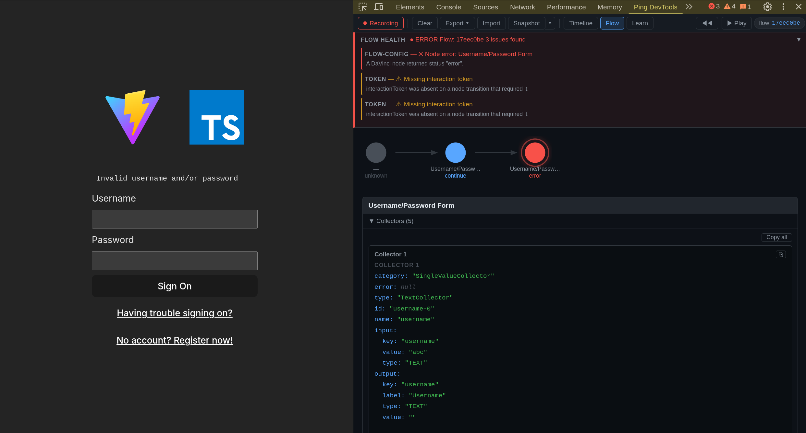

# WolfCola DevTools

**Captures, correlates, and diagnoses** OIDC/OAuth 2.0 authentication flows in real time — works standalone with any OIDC provider or as an enhanced companion to the Ping Identity SDK.

Available as a **browser DevTools panel** (Chrome & Firefox) and a **VS Code extension** (via Chrome DevTools Protocol). Both share the same annotation engine, diagnosis rules, and Elm UI.



---

## Packages

| Package | Description | npm |
| --- | --- | --- |
| [`devtools-extension`](packages/devtools-extension) | Chrome & Firefox DevTools panel — Timeline, Flow, and Learn views | private |
| [`vscode-extension`](packages/vscode-extension) | VS Code extension — debugs via Chrome DevTools Protocol | private |
| [`devtools-core`](packages/devtools-core) | Shared logic — annotators, diagnosis engine, event store, export | private |
| [`devtools-ui`](packages/devtools-ui) | Shared Elm UI — compiled JS, CSS, TypeScript port interface | private |
| [`devtools-bridge`](packages/devtools-bridge) | SDK adapter — emits events from DaVinci, Journey, and OIDC clients | [](https://www.npmjs.com/package/@wolfcola/devtools-bridge) |
| [`devtools-types`](packages/devtools-types) | Effect Schema definitions for AuthEvent, FlowState | [](https://www.npmjs.com/package/@wolfcola/devtools-types) |

---

## Quick start

### Browser extension

```bash
pnpm install
pnpm build              # Chrome (default)
pnpm build:firefox      # Firefox
```

Load the extension as unpacked from `packages/devtools-extension/dist/` — see the [extension README](packages/devtools-extension) for full instructions.

### VS Code extension

```bash
pnpm install
pnpm build
```

Launch VS Code with the extension loaded:

```bash
code --extensionDevelopmentPath=packages/vscode-extension
```

Then launch a Chromium-based browser with remote debugging enabled (**must be a separate instance** — use `--user-data-dir` to avoid conflicts with your normal browser):

```bash
chromium --remote-debugging-port=9222 --no-first-run --user-data-dir=/tmp/oidc-devtools-test
```

In the VS Code window, run `Ctrl+Shift+P` → **"OIDC DevTools: Start Capture"** → enter `9222`. Auth-related events will appear in the Timeline as you browse.

See the [VS Code extension README](packages/vscode-extension) for detailed setup, troubleshooting, and the mock OIDC server for testing.

### Browser compatibility

| Browser | Minimum version |
| --- | --- |
| Chrome | 88+ (Manifest V3) |
| Firefox | 128+ (`world: "MAIN"` content scripts) |

### SDK integration (optional)

The extension captures and annotates OIDC network traffic automatically. To also see SDK-level events, add the bridge:

```bash
pnpm add @wolfcola/devtools-bridge
```

```ts
import { davinci } from '@forgerock/davinci-client';
import { attachDevToolsBridge } from '@wolfcola/devtools-bridge';

const client = await davinci({ config });
attachDevToolsBridge(client, config);
```

The bridge is a no-op when the extension is not installed.

---

## Architecture

```
┌──────────────────────────────────────────────────────────┐
│                    Shared Packages                        │
│  devtools-core: annotators, diagnosis, event store       │
│  devtools-ui:   Elm UI (Timeline, Flow, Learn)           │
│  devtools-types: Effect Schema definitions               │
└─────────────────────┬────────────────────────────────────┘
                      │
          ┌───────────┴───────────┐
          ▼                       ▼
┌──────────────────┐    ┌──────────────────┐
│ Browser Extension│    │ VS Code Extension│
│ Chrome / Firefox │    │ CDP → Chrome     │
│                  │    │                  │
│ content scripts  │    │ CDP client       │
│ service worker   │    │ TreeView         │
│ Elm panel        │    │ WebView (Elm)    │
└──────────────────┘    └──────────────────┘
```

Both consumers import the same annotators, diagnosis engine, and Elm UI from the shared packages. The only difference is how events enter the system:

- **Browser extension** → `chrome.devtools.network.onRequestFinished` + content script relay
- **VS Code extension** → CDP `Network` domain + `Runtime.bindingCalled` for SDK events

---

## Network-first OIDC intelligence

The extension automatically detects and annotates OIDC/OAuth 2.0 traffic without any SDK integration. It works out of the box with **any OIDC provider** — Ping Identity, Auth0, Okta, Keycloak, or any spec-compliant authorization server.

**Well-known discovery** — parses `/.well-known/openid-configuration` responses and matches subsequent requests against discovered endpoints.

**OIDC semantic annotation:**

| Phase | Extracted data |
| --- | --- |
| **discovery** | Issuer, all discovered endpoints |
| **authorize** | `client_id`, `state`, `nonce`, `code_challenge`, `response_type` |
| **par** | `request_uri`, `expires_in`, pushed parameters |
| **token** | `grant_type`, `code_verifier`, tokens received, `token_type` |
| **userinfo** | User profile data |
| **revocation** | Token revocation status |
| **introspection** | Token validity |
| **end-session** | Logout status |

**DPoP detection (RFC 9449)** — detects `DPoP` proof JWTs, `token_type: "DPoP"`, `use_dpop_nonce` errors, and `DPoP-Nonce` headers.

**PAR detection (RFC 9126)** — detects Pushed Authorization Requests and correlates `request_uri` values.

---

## Diagnosis

Every captured event is run through a rule engine that produces flow-level and per-event diagnostics with severity ratings and numbered remediation steps.

| Category | Examples |
| --- | --- |
| **CORS** | Status-zero failures, missing `Access-Control-Allow-Origin`, wildcard + credentials |
| **Token** | Missing `interactionToken` on non-initial nodes, expired JWTs |
| **Flow config** | Node error/failure status, connector errors, policy-not-found |
| **OIDC** | State mismatch, missing PKCE, redirect URI mismatch |
| **OIDC flow** | Auth code without PKCE, missing `code_verifier`, implicit flow, nonce, code reuse |
| **DPoP** | Missing proof, invalid proof structure, method/URI mismatch |
| **PAR** | Missing `request_uri`, inline params alongside `request_uri` |

---

## Panel views

### Timeline

Chronological event table with type badges (NET, SDK, SES, CFG), status codes, OIDC phase tags, and inline CORS/DPoP indicators. A graph sidebar draws SDK node-change events as a vertical rail. The Inspector panel shows contextual tabs (Headers, SDK State, Collectors, OIDC, Diagnosis, etc.).

### Flow

Visual representation of the authentication flow as a sequence of SDK nodes. Includes a node rail, detail cards, playback controls, and a Flow Health banner for diagnosis.

### Learn

Canvas-based flow lifecycle visualization with layout variants for DaVinci, Journey, OIDC Code, OIDC+DPoP, and OIDC+PAR flows.

---

## Development

```bash
pnpm install
pnpm build              # build all packages
pnpm test               # vitest (308 tests)
pnpm typecheck          # TypeScript type checking
pnpm lint               # eslint
```

| Script | Description |
| --- | --- |
| `pnpm build` | Build all packages |
| `pnpm test` | Run all unit tests |
| `pnpm typecheck` | TypeScript type checking |
| `pnpm lint` | Lint all packages |
| `pnpm changeset` | Create a changeset for versioning |
| `pnpm version` | Apply changesets and bump versions |
| `pnpm release` | Build and publish to npm |

### Tech stack

- **TypeScript** with strict mode and Effect for typed functional effects
- **Elm 0.19** for the DevTools panel UI
- **esbuild** for bundling
- **Vitest** for unit tests, **Playwright** for e2e tests
- **pnpm workspaces** for monorepo management
- **Changesets** for versioning and publishing

---

## Security and privacy

The extension requests only `storage` and `clipboardWrite`/`clipboardRead` — no `cookies`, `webRequest`, `tabs`, or other sensitive APIs. Content scripts use a two-world architecture to prevent arbitrary page code from injecting messages into the background script. All SDK events are decoded through `AuthEventSchema` (Effect Schema) before reaching the EventStore — malformed payloads are dropped. Captured data is stored locally and never transmitted off-device.

---

## License

MIT — see [LICENSE](./LICENSE) for details.
