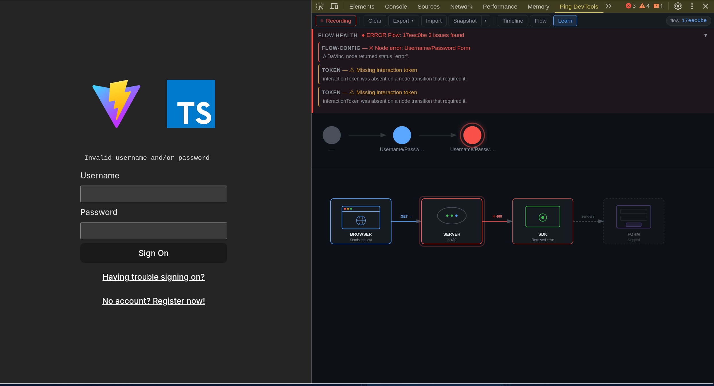

# WolfCola DevTools — Browser Extension

**Captures, correlates, and diagnoses** OIDC/OAuth 2.0 authentication flows in real time — works standalone with any OIDC provider or as an enhanced companion to the Ping Identity SDK.

Most auth debugging starts in the Network panel and stays there — copying tokens into jwt.io, cross-referencing timestamps, guessing which 400 was the CORS preflight and which was a bad grant. WolfCola DevTools replaces that with a single panel that captures network traffic, annotates it with OIDC semantics, optionally merges in SDK-level events, and runs an automated diagnosis engine that tells you _what went wrong and how to fix it_.

Supports **Chrome 88+** and **Firefox 128+**.


---

## Status

**v0.1.0 — alpha, active development.** The extension is functional and loadable as an unpacked extension in Chrome and Firefox. The package is private (`@wolfcola/devtools-extension`).

---

## Network-first OIDC intelligence

The extension automatically detects and annotates OIDC/OAuth 2.0 traffic without any SDK or bridge integration. This means it works out of the box with **any OIDC provider** — Ping Identity, Auth0, Okta, Keycloak, or any spec-compliant authorization server.

**Well-known discovery** — when the extension sees a request to `/.well-known/openid-configuration` or `/.well-known/oauth-authorization-server`, it parses the response and stores the discovered endpoints (`authorization_endpoint`, `token_endpoint`, `userinfo_endpoint`, etc.). Subsequent requests are matched against these discovered endpoints first, falling back to regex patterns.

**OIDC semantic annotation** — network events that match OIDC endpoints are annotated with structured metadata:

| Phase             | Extracted data                                                   |
| ----------------- | ---------------------------------------------------------------- |
| **discovery**     | Issuer, all discovered endpoints                                 |
| **authorize**     | `client_id`, `state`, `nonce`, `code_challenge`, `response_type` |
| **par**           | `request_uri`, `expires_in`, pushed parameters                   |
| **token**         | `grant_type`, `code_verifier`, tokens received, `token_type`     |
| **userinfo**      | User profile data                                                |
| **revocation**    | Token revocation status                                          |
| **introspection** | Token validity                                                   |
| **end-session**   | Logout status                                                    |

**DPoP detection (RFC 9449)** — detects `DPoP` proof JWTs in request headers, `token_type: "DPoP"` in responses, `use_dpop_nonce` errors, and `DPoP-Nonce` response headers.

**PAR detection (RFC 9126)** — detects Pushed Authorization Requests, correlates `request_uri` values between PAR responses and subsequent authorize redirects.

---

## Diagnosis

Every captured event is run through a rule engine that produces flow-level and per-event diagnostics with severity ratings and numbered remediation steps.

**Flow Health** — a banner at the top surfaces the worst-severity issue across the entire flow. It stays hidden when everything is healthy, expands automatically when a new error arrives during recording, and each issue is clickable — jumping directly to the related event in the Timeline.

**Per-event annotations** — the Inspector's Diagnosis tab appears only when the selected event has issues. Errors get a solid dot on the tab label; warnings get a half dot. Each annotation includes a title, description, relevant data pairs, and step-by-step remediation.

The engine covers:

| Category        | Examples                                                                                       |
| --------------- | ---------------------------------------------------------------------------------------------- |
| **CORS**        | Status-zero failures, missing `Access-Control-Allow-Origin`, wildcard + credentials conflict   |
| **Token**       | Missing `interactionToken` on non-initial nodes, expired JWTs in request headers               |
| **Flow config** | Node error/failure status, connector errors, policy-not-found                                  |
| **OIDC**        | State mismatch, missing PKCE, redirect URI mismatch                                            |
| **OIDC flow**   | Auth code without PKCE, missing `code_verifier`, implicit flow, missing nonce, auth code reuse |
| **DPoP**        | Missing proof, invalid proof structure, method/URI mismatch, nonce required                    |
| **PAR**         | Missing `request_uri` in response, inline params alongside `request_uri`                       |

---

## JWT decoding

Any JWT-like string in the JSON tree viewer (response bodies, headers, SDK state) is automatically detected and rendered as an expandable **JWT** dropdown. Clicking it reveals:

- **Header** — algorithm, type, key ID
- **Claims** — all payload claims with timestamp formatting for `exp`, `iat`, `nbf`
- **Signature** — preview (not verified)

JWT decoding is implemented entirely in Elm with a pure base64url decoder — no external dependencies or JavaScript interop.

---

## Import and export

Flows can be exported for sharing or offline analysis, and imported from JSON.

**Export** — the toolbar dropdown offers two formats:

- **JSON** — full flow state including all events, OIDC annotations, a summary (node count, error count, CORS flags, duration), and metadata. Sensitive data (tokens, passwords, cookies) is automatically redacted.
- **Markdown** — a human-readable report with a flow summary and event timeline grouped by type.

**Import** — paste exported JSON into the import modal. The imported flow replaces live recording (recording pauses automatically). A metadata banner shows the flow ID, capture timestamp, and redaction status. Click **Clear** to discard the import and resume live capture.

---

## Snapshots

Click **Snapshot** to save the current flow state to local storage (up to 5 snapshots, oldest dropped when full). The dropdown arrow next to the button opens a list of saved snapshots showing flow ID, timestamp, and event count. Click an entry to load it (same as importing — recording pauses, import banner appears). Click the delete button to remove a snapshot.

---

## Time-travel playback

The Flow view includes transport controls (**Prev / Play / Pause / Reset**) that step through SDK nodes in sequence. During playback the interval between steps mirrors the real elapsed time, clamped to 300 ms - 1500 ms, so you can watch the flow unfold at roughly the pace it happened.

---

## Architecture

```
Host page
  ├── attachDevToolsBridge(davinciClient)   ─┐
  ├── attachJourneyBridge(journeyClient)    ─┤─ CustomEvent('pingDevtools')
  └── attachOidcBridge(oidcClient)          ─┘
            │
      content-script.ts  (MAIN world — postMessage only, no chrome.runtime)
            │
      relay.ts           (isolated world — chrome.runtime.sendMessage)
            │
      service-worker.ts  (Effect ManagedRuntime)
        ├── @wolfcola/devtools-core:
        │     ├── AuthEventSchema validation (Effect Schema)
        │     ├── EventStore (chrome.storage.local-backed Layer)
        │     ├── OIDC annotation pipeline (annotators)
        │     └── diagnosis-engine (flow rules + event rules)
        └── broadcast to panel(s)
            │
      @wolfcola/devtools-ui → Elm panel
        ├── Timeline view  — chronological event table with Inspector
        ├── Flow view      — node rail + detail card + health banner
        └── Learn view     — flow-aware lifecycle visualization
```

### Shared packages

This extension imports shared logic and UI from two sibling packages:

- **[`@wolfcola/devtools-core`](../devtools-core)** — annotators, diagnosis engine, event store, message handler, export logic. All pure TypeScript/Effect with no browser dependencies.
- **[`@wolfcola/devtools-ui`](../devtools-ui)** — compiled Elm UI (JS + CSS) and TypeScript port interface.

The extension itself owns only browser-extension-specific code: the manifest, service worker (chrome.runtime wiring + chrome.storage EventStore layer), content scripts, devtools page, and panel.ts (Elm port wiring to chrome.runtime).

---

## Build

```bash
pnpm build              # Chrome (default)
pnpm build:firefox      # Firefox
```

Output is written to `dist/`. Both targets produce the same JS bundles — only the manifest differs (Firefox uses `background.scripts` instead of `background.service_worker` and includes `browser_specific_settings.gecko`).

The build copies compiled Elm and CSS from `@wolfcola/devtools-ui` — Elm is no longer compiled in this package.

---

## Load in Chrome

1. Open `chrome://extensions`
2. Enable **Developer mode** (top-right toggle)
3. Click **Load unpacked**
4. Select `packages/devtools-extension/dist/`
5. Open DevTools on any page with OIDC traffic — the **WolfCola DevTools** tab appears

After rebuilding, click the refresh icon on the extension card at `chrome://extensions`, then close and reopen DevTools.

---

## Load in Firefox

1. Run `pnpm build:firefox`
2. Open `about:debugging#/runtime/this-firefox`
3. Click **Load Temporary Add-on...**
4. Select `packages/devtools-extension/dist/manifest.json`
5. Open DevTools on any page with OIDC traffic — the **WolfCola DevTools** tab appears

---

## Wiring up your app

The extension captures and annotates all OIDC network traffic automatically — **no SDK integration is required**. To also see SDK-level events (node transitions, journey steps, OIDC phases, session diffs), add the bridge adapter to your app.

```bash
pnpm add @wolfcola/devtools-bridge
```

All `attach*` functions are safe to call unconditionally — they are no-ops when the extension is not installed and when running in SSR/Node.

### DaVinci

```ts
import { davinci } from '@forgerock/davinci-client';
import { attachDevToolsBridge } from '@wolfcola/devtools-bridge';

const client = await davinci({ config });
attachDevToolsBridge(client, config);
```

### AM Journey

```ts
import { attachJourneyBridge } from '@wolfcola/devtools-bridge';

attachJourneyBridge(journeyClient, config);
```

### OIDC / OAuth

```ts
import { attachOidcBridge } from '@wolfcola/devtools-bridge';

attachOidcBridge(oidcClient, { clientId: 'my-spa-client', ...config });
```

---

## Panel views

### Timeline

A chronological table of all captured events. Each row shows event type, status, method, and URL with colour-coded error/CORS flags. Network events with OIDC annotations show a phase badge (e.g. `authorize`, `token`, `par`). A **graph sidebar** draws a vertical SVG rail of SDK node-change events with status-coloured circles and connector lines — click a node in the rail to jump to it in the table. Click any row to open its Inspector panel.

**Inspector tabs:**

| Tab            | Shows                                                                                  | Appears for            |
| -------------- | -------------------------------------------------------------------------------------- | ---------------------- |
| **Headers**    | Request and response headers, request/response bodies with JWT decoding                | Network events         |
| **SDK State**  | Full node data — status transitions, tokens, errors, collectors, authorization         | SDK events             |
| **Collectors** | Interactive collector list with copy-all button                                        | SDK node-change events |
| **Cookies**    | Cookie values extracted from request/response headers                                  | Network events         |
| **Session**    | Before/after values for localStorage changes                                           | Session storage events |
| **Config**     | SDK configuration JSON                                                                 | Config events          |
| **CORS**       | Failure reason, preflight status, `Allow-Origin` / `Allow-Credentials` values          | CORS-flagged events    |
| **OIDC**       | Phase, grant type, PKCE status, DPoP proof, tokens received, state/nonce, OAuth errors | OIDC-annotated events  |
| **Diagnosis**  | Severity, title, description, relevant data pairs, remediation steps                   | Events with issues     |

### Flow

A visual representation of the authentication flow as a sequence of SDK nodes. The node rail draws coloured circles for each node with arrows connecting them, status and node-name labels, and a glow effect on the selected node. Selecting a node opens a detail card with contextual information — collectors for DaVinci, callbacks for Journey steps, phase and error data for OIDC — plus any causally linked network requests with expandable request/response bodies. The Flow Health banner appears above the rail when the diagnosis engine detects issues.

### Learn

A canvas-based visualization that maps the request lifecycle. The layout adapts automatically based on what events are present:

| Layout          | When                                | Card sequence                                   |
| --------------- | ----------------------------------- | ----------------------------------------------- |
| **DaVinci**     | DaVinci node-change events detected | Browser -> Server -> SDK -> Form                |
| **Journey**     | AM Journey step events detected     | Client -> AM Server -> Callbacks -> Result      |
| **OIDC Code**   | OIDC network events (no SDK)        | Client -> Auth Server -> Token -> Result        |
| **OIDC + DPoP** | DPoP proof detected                 | Client -> Auth Server -> Token+DPoP -> Result   |
| **OIDC + PAR**  | PAR request detected                | Client -> PAR -> Auth Server -> Token -> Result |



---

## Security and privacy

The extension requests only `storage` and `clipboardWrite`/`clipboardRead` — no `cookies`, `webRequest`, `tabs`, or other sensitive APIs. Content scripts use a two-world architecture: `content-script.ts` runs in the MAIN world (page access, no extension runtime), while `relay.ts` runs in the isolated world (runtime access, guarded by a sentinel flag and same-source check). All SDK events are decoded through `AuthEventSchema` (Effect Schema) before reaching the EventStore — malformed payloads are dropped. Captured data is stored in `storage.local` under a namespaced key and never transmitted off-device. No remote code is loaded or executed.

---

## Testing

```bash
pnpm test    # unit tests (vitest)
```

E2E tests are in the [`e2e/`](../../e2e) package at the repo root.

---

## License

MIT
